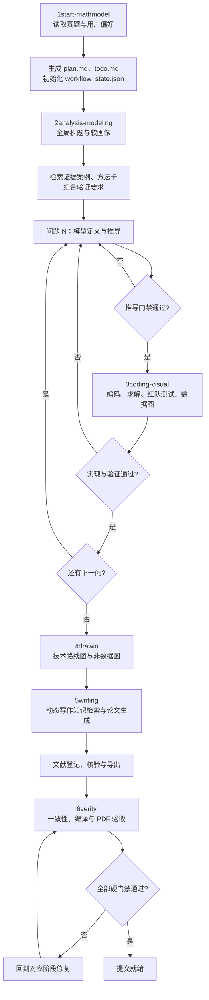

# MathModelAgent

MathModelAgent 是一个面向数学建模竞赛的本地 Skills-first 智能体工作流。它从赛题理解开始，依次完成任务拆解、模型设计、代码求解、数据可视化、流程图绘制、论文写作和最终验收，并通过本地知识库、门禁协议与机器可读状态文件保证过程可以追踪、恢复和复核。

当前版本不需要启动前端、FastAPI、Redis 或 WebSocket 服务。工作流直接在 Agent Harness 中运行，状态、结果、论文和图表都写入当前建模项目目录。

## 核心能力

- **完整竞赛链路**：覆盖赛题分析、数学建模、编程求解、图表生成、论文写作和提交前验收。
- **逐题闭环**：第 N 问完成建模后立即编码验证，真实结果会反馈给下一问，而不是先空想完所有模型再统一写代码。
- **软路由画像**：分别评估机理、数据和优化成分，允许混合路线，不再把题目硬分为 B/C 类。
- **分层知识库**：组合可追溯案例、方法卡、验证规则和写作技法，不把历史论文当成可机械复制的答案。
- **真实结果约束**：论文数值只能来自代码输出、结果报告或已生成图表，禁止编造结果和不一致的四舍五入。
- **文献闭环**：搜索由当前 Harness 完成，本地工具负责登记、去重、核验和 Typst/LaTeX 导出。
- **可中断恢复**：`workflow_state.json` 记录阶段、子问题、门禁、产物与未解决问题，可从中断处继续。
- **双排版引擎**：论文阶段支持 Typst 和 LaTeX，并保留不同竞赛的模板结构。

## 整体工作流



### 六阶段职责

| 阶段 | 主要任务 | 核心产物 | 关键门禁 |
| --- | --- | --- | --- |
| `1start-mathmodel` | 读取题目与附件、询问竞赛和排版偏好、建立计划 | `plan.md`、`todo.md`、`workflow_state.json` | 输入完整、偏好明确、工作目录可写 |
| `2analysis-modeling` | 全局拆题、逐题软画像、知识检索、模型推导与可求解化 | `reports/ANALYSIS_MODELING_REPORT.md`、`analysis/derivations.md` | 定义清楚、假设有依据、推导完整、形式可求解 |
| `3coding-visual` | 数据清洗、实现模型、运行实验、红队测试、生成数据图 | `code/`、`figures/`、`reports/RESULTS_REPORT.md` | 实现与推导一致、结果可复现、验证证据充分 |
| `4drawio` | 绘制技术路线、求解流程、模型结构和指标体系 | `figures/*.drawio`、`figures/*.pdf`、`reports/DRAWIO_REPORT.md` | 图示与真实方法一致，不重复数据图 |
| `5writing` | 选择模板、按章节检索写作技法、组织图表与文献 | `paper/main.typ` 或 `paper/main.tex`、参考文献文件 | 数值真实、引用已核验、章节符合比赛模板 |
| `6verity` | 文本门禁、引用检查、数值一致性、编译和 PDF 视觉验收 | `reports/VERIFY_REPORT.md`、最终 PDF | 所有硬错误修复，状态与必需产物校验通过 |

## 逐题交替建模

建模和编码不是两个完全分离的大阶段，而是按子问题交替执行：

```text
全局分析
  -> 问题一建模 -> 问题一编码验证
  -> 问题二建模（读取问题一真实结果）-> 问题二编码验证
  -> 问题三建模（读取前两问真实结果）-> 问题三编码验证
  -> 汇总图示 -> 论文写作 -> 最终验收
```

每道子问题至少经过两类门禁：

1. **推导门禁**：检查目标、变量、约束、假设、公式和可求解形式。
2. **验证门禁**：检查代码实现、数据来源、核心数值、边界条件和红队测试。

如果某一门禁为 `FAIL`，对应阶段不能标记为完成；修订模型后必须同步更新推导、代码和报告。

## 知识库架构

本地检索不是简单返回“相似论文”，而是组合四类知识：

| 层级 | 内容 | 用途 |
| --- | --- | --- |
| 证据案例层 | 139 张 Pro 案例卡，对应 138 个来源论文标题 | 提供可追溯的历史方案、适用边界和可迁移经验 |
| 方法卡层 | 225 条本地方法记录 | 补充候选模型、求解流程、验证方法和常见失败模式 |
| 规则与验证层 | 模型选择规范、工作流门禁和专题知识 | 根据机理/数据/优化软画像组合验证要求 |
| 写作知识层 | 摘要、假设、求解、敏感性和评价等章节技法 | 写作时按章节动态检索，静态文档只作兜底 |

一次建模检索通常返回 2-3 张证据案例、1-3 张方法卡以及与当前子问题匹配的验证要求。案例用于启发和佐证，不允许直接复制历史参数、权重或结论。

## 状态与恢复

`todo.md` 面向用户展示待办，`workflow_state.json` 是机器可读事实来源。状态文件记录：

- 当前阶段及阶段状态；
- 每个子问题的完成情况；
- `PASS / WARN / FAIL` 门禁；
- 已生成及必需产物；
- 未解决问题和修复记录。

```powershell
cd backend

# 初始化或查看状态
.\.venv\Scripts\python.exe scripts\workflow_state.py init
.\.venv\Scripts\python.exe scripts\workflow_state.py show

# 最终检查状态结构和必需产物
.\.venv\Scripts\python.exe scripts\workflow_state.py validate --root ..
```

## 本地工具

### 建模知识检索

```powershell
cd backend
.\.venv\Scripts\python.exe scripts\search_knowledge.py `
  --task-types "预测,优化" `
  --keywords "时间序列,资源调度" `
  --data-conditions "小样本,缺失值" `
  --top 6
```

### 写作知识检索

```powershell
.\.venv\Scripts\python.exe scripts\search_writing_knowledge.py `
  --section-type "摘要" `
  --keywords "预测,优化,鲁棒性" `
  --top 3 `
  --format markdown
```

论文阶段会分别检索摘要、问题分析、模型假设、模型建立与求解、敏感性分析和模型评价，不用一次宽泛检索代替全部章节。

### 文献登记与导出

```powershell
# 初始化登记表
.\.venv\Scripts\python.exe scripts\literature_registry.py init

# 校验重复 DOI、作者、年份、来源和正文用途
.\.venv\Scripts\python.exe scripts\literature_registry.py validate

# 按论文引擎导出
.\.venv\Scripts\python.exe scripts\literature_registry.py export --format typst --output ../paper/references.typ
.\.venv\Scripts\python.exe scripts\literature_registry.py export --format latex --output ../paper/references.tex
```

同一文献只在登记表和参考文献表中保留一条，但正文可以在多个必要位置复用同一引用键。未核验文献不能进入最终参考文献。

## 项目目录

```text
MathModelAgent/
├─ skills/
│  ├─ 1start-mathmodel/        工作流入口
│  ├─ 2analysis-modeling/      赛题分析与建模
│  ├─ 3coding-visual/          编程求解与数据图
│  ├─ 4drawio/                 非数据图示
│  ├─ 5writing/                Typst / LaTeX 论文写作
│  ├─ 6verity/                 最终验证和验收
│  └─ _references/             共享规范与协议
├─ backend/
│  ├─ app/core/knowledge/      本地分层知识库
│  ├─ app/tests/               本地运行时测试
│  └─ scripts/                 检索、状态、文献和审计 CLI
└─ README.md
```

## 安装与验证

项目使用 Python 3.12+ 和 `uv` 管理本地工具依赖：

```powershell
cd backend
uv sync
```

运行完整验证：

```powershell
.\.venv\Scripts\python.exe -m unittest app.tests.test_pro_knowledge app.tests.test_routing app.tests.test_runtime_tools -v
.\.venv\Scripts\python.exe -m ruff check app/core/knowledge app/tests scripts
.\.venv\Scripts\python.exe -m compileall -q app/core/knowledge scripts
uv lock --check
```

当前测试覆盖知识库分层融合、软路由画像、动态写作检索、工作流状态恢复、文献核验和参考文献导出。

## 运行边界

- 不需要启动 Web 服务、Redis、前端或 Docker。
- Web 搜索与页面核验由当前 Agent Harness 提供。
- 本地代码负责知识检索、状态维护、文献登记、产物生成和最终验收。
- 历史案例与写作知识只提供证据和方法提示，最终模型必须根据当前赛题重新推导并通过验证。
